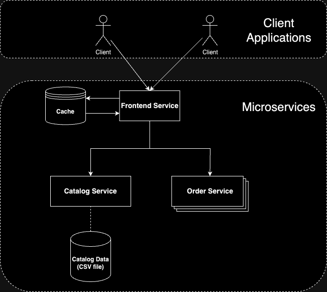
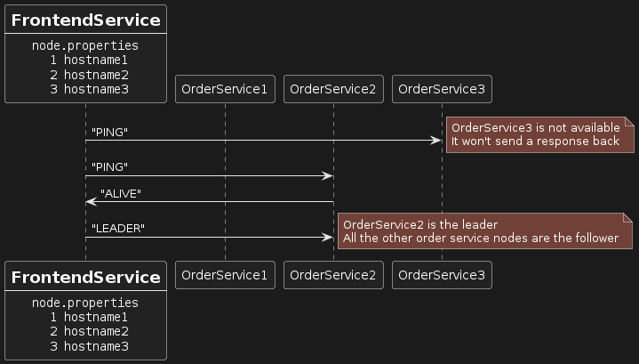
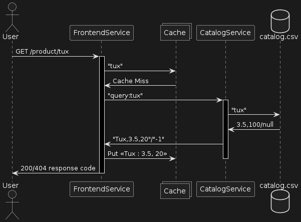
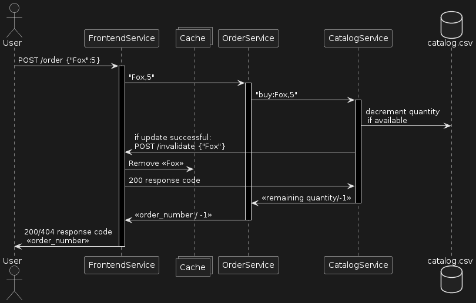
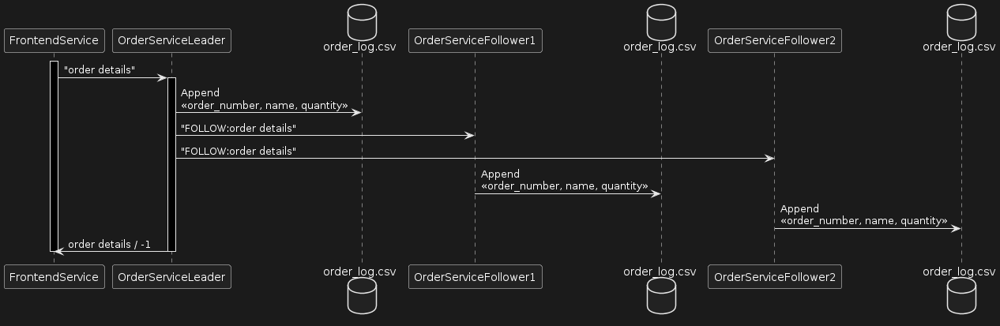
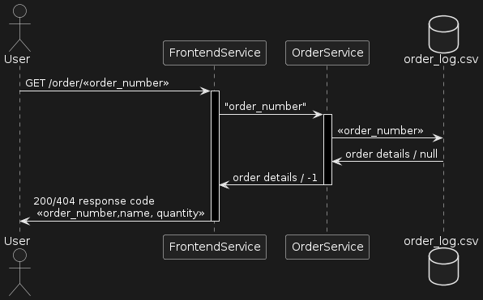

**Title: A caching enabled, fault-tolerant Microservices Architecture Design for Toy Store Application**

# Introduction:

A centralised web application has several drawbacks which includes scalability, load distribution across applications in a single server etc.

A simple solution to this approach is to use a microservice architecture.

According to microservices.io: Microservices - also known as the microservice architecture - is an architectural style that structures an application as a collection of services that are:
1. Independently deployable
2. Loosely coupled

Services are typically organized around business capabilities. Each service is often owned by a single, small team.

The microservice architecture enables an organization to deliver large, complex applications rapidly, frequently, reliably and sustainably - a necessity for competing and winning in today’s world.

In addition to deploying individual services, several replicas of the same service can be deployed to overcome the problem of single point of failure in distributed systems. Having multiple replicas of the service also carries additional overhead of guaranteeing consistency across different replicas which can be handled by designing fault tolerant systems. 
To further improve the performance of the web application, a caching layer can be used to send quick response for particular requests. 

# Goals and Objective:
The goal here is to implement a microservices architecture for the Toy Store application which will have a caching layer enabled and also provide a fault tolerant system by creating several replicas of the same service. The system is divided into three main microservices: Catalog Service, Order Service, and Frontend Service. Each service is responsible for specific functionalities.

# Architecture Overview:

The system consists up of a 3 microservice architecture. The frontend tier is implemented as a single microservice (Frontend Service), responsible for handling client requests and communicating with the catalog and order microservice. The catalog and order services are responsible for managing catalog data and processing orders, respectively.

#### Diagram:



**Microservices Description:**

- **Catalog Service:**
    - The Catalog Service is responsible for managing the catalog data, including product information such as name, price, and quantity.
    - It uses simple socket based APIs for querying product details and updating product quantities.
    - The service initializes catalog data from a CSV file on startup and persists changes to the catalog on disk.
    - A ConcurrentHashMap is used to store catalog data in memory for efficient querying and updating.
    - It replenishes the out of stock items every 10 sec.
    - The Service send invalidation request to FrontEndService whenever there is an update in the stock items. 

- **Order Service:**
    - The Order Service handles order processing, including checking product availability and logging orders.
    - It communicates with the Catalog Service by sending messages over a socket connection to verify product availability before processing orders.
    - Orders are logged to a CSV file on disk for persistence.
    - Order Service has been replicated into different machines to implement a fault tolerant system.
    - Every replica syncs with any other active replica to retrieve all the missed order details.

- **Frontend Service:**
    - The Frontend Service acts as the entry point for client requests and serves as an interface between clients and Catalog and Order services.
    - Exposes REST APIs for querying product details and placing orders.
    - Uses HTTPServer from the Java standard library to handle incoming HTTP requests concurrently.
    - Routes client requests to appropriate backend services based on the requested functionality.
    - A caching layer is introduced to send quicker response for query requests back to the client.
    - Leader election for the order service is handled in this layer.

**Database:**

- **Catalog Database:**
    - Catalog data is loaded from and persisted to a CSV file on disk.

- **Order Logging:**
    - Order logs are written to a CSV file on disk for persistence.

# Leader Election and maintaining consistency

To avoid the problem of single point of failure, order service is replicated and where each order service replica has a unique id. The frontend service selects the order service with the highest id and elects it as leader. The leader node then forwards the order request after processing it to the follower nodes to maintain consistency in the order logs. 

If the leader crashes, the frontend service will notice the crash and then select the node with the highest id.



When the crashed node comes back up, it will sync with one of the active nodes to get all the missed order and then start processing requests.

# REST APIs

The frontend service exposes 2 rest apis used for querying making buy requests. These are:
1. `GET /products/<product_name>`

   This API is used to query the details of a product. If the query is successful, the server should return a JSON reply with a top-level `data` object. Similar to lab 1, the `data` object has three fields: `name`, `price`, and `quantity`. For instance,

    ```json
    {
        "data": {
            "name": "Tux",
            "price": 15.99,
            "quantity": 100
        }
    }
    ```

   If things go wrong, for example, if the product name provided by the client does not exist, the
   front-end service should return a JSON reply with a top-level `error` object. The `error` object
   should contain two fields: `code` (for identifying the type of the error) and `message` (human-readable explanation of what went wrong). For instance,

    ```json
    {
        "error": {
            "code": 404,
            "message": "product not found"
        }
    }
    ```
   
    With the introduction of a caching layer, if the cache has the requested product, the frontend service will return the response back to the user else it will check with the catalog service.
   
2. `POST /orders`

   This API will try to place an order for a certain product. The client should attach a JSON body
   to the POST request to provide the information needed for the order (`name` and `quantity`).

    ```json
    {
        "name": "Tux",
        "quantity": 1
    }
    ```

   If the order is placed successfully, the front-end service returns a JSON object with a
   top-level `data` object, which only has one field named `order_number`.

    ```json
    {
        "data": {
            "order_number": 10
        }
    }
    ```

   In case of error, the front-end service returns a JSON reply with a top-level `error` object,
   which has two fields, `code` and `message`, similar to the product query API.
   

    Since there are several order replicas, the request will be sent to the leader node and the leader node will then forward the request to the follower nodes.
   


3. `GET /order/<order_number>`

    This API will retrieve the order details from OrderService. If the query is successful, the server should return a JSON reply with a top-level `data` object. The `data` object has three fields: `number`, `name`, and `quantity`. For instance,
    ```json
    {
        "data": {
            "number": "20",
            "name": "Tux",
            "quantity": 100
        }
    }
    ```

    If things go wrong, for example, if the order_number provided by the client does not exist, the front-end service should return a JSON reply with a top-level `error` object. The `error` object should contain two fields: `code` (for identifying the type of the error) and `message` (human-readable explanation of what went wrong). For instance,
    ```json
    {
        "error": {
            "code": 404,
            "message": "order not found"
        }
    }
    ```

   


[//]: # (**6. Docker Containerization:**)

[//]: # ()
[//]: # (**6.1 Dockerfile:**)

[//]: # (Each microservice has its Dockerfile defined within its respective directory. The Dockerfile specifies the base image, dependencies, and commands required to build the microservice image.)

[//]: # ()
[//]: # (**6.2 Docker Compose:**)

[//]: # (A Docker Compose file is used to define and manage the multi-container Docker application. It specifies the services &#40;microservices&#41; required, along with their configurations, dependencies, and volume mounts. Additionally, the Docker Compose file ensures proper networking between the microservices.)

[//]: # ()
[//]: # (**6.3 Volume Mounting:**)

[//]: # (To ensure data persistence, volumes are mounted for the Catalog Service and Order Service. This allows the services to read and write data from/to directories on the host machine. For example, the catalog data is stored in the `/usr/src/app/data` directory, and the order logs are stored in the `/usr/src/app/logs` directory. This setup ensures that data and logs are retained even if the containers are removed.)

# Steps to run

Prerequisites:
1. In your src directory compile the java code:
```shell
javac catalogservice/*.java
javac orderservice/*.java
javac frontendservice/*.java frontendservice/handler/*.java frontendservice/cache/*.java
```

2. Run catalog service by setting environment variable `hostname:8081` of where you are planning frontend service to run. 
```shell
export FRONTEND_HOST=localhost:8081
java catalogservice.CatalogService
```

3. Run each replica of order service by passing in the hostname of other replicas as a command line parameter.

```shell
export CATALOG_HOST=localhost
java orderservice.OrderService hostname1 hostname2
```

4. Set the values of node id and hostname in the file frontendservice/handler/nodes.properties.
    
eg. of `nodes.properties` file:
```
1 localhost
2 elnux2.cs.umass.edu
```
Run the frontend service
```shell
export CATALOG_HOST=localhost
java frontendservice.FrontEndService
```

Test the client by setting the environment variable `hostname:8080` and running:
```shell
export REMOTE_HOST=localhost:8080

javac client/Client.java
java client.Client
```

**8. References:**

- Docker Documentation: https://docs.docker.com/
- Microservices Architecture Patterns: https://microservices.io/patterns/index.html