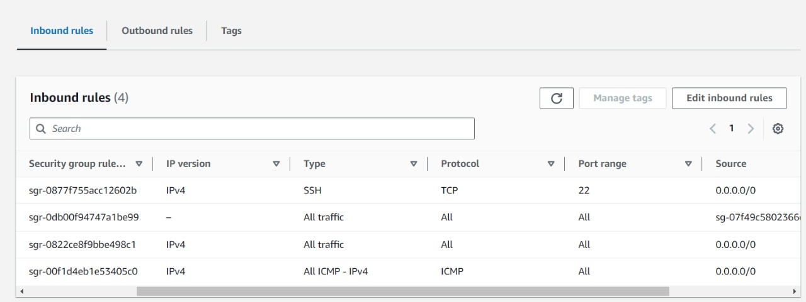
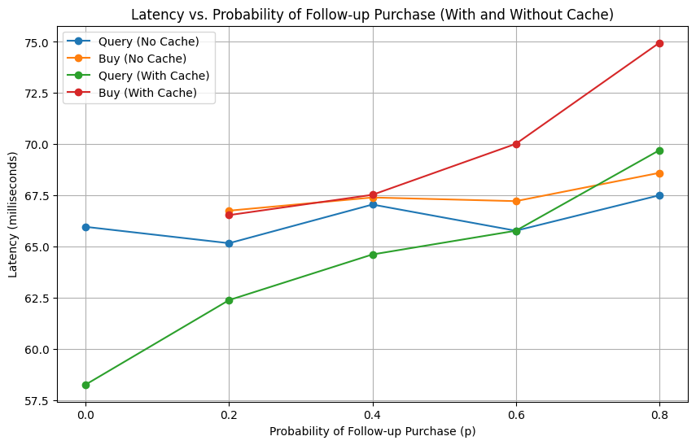

# Evaluation document

### Steps to deploy application on AWS instance:
1. Configure AWS setting

   Region chosen: us-east-1
2. Create instance/'s

    * Instance type used `t2.micro`

    * Image id (AMI) used `ami-0d73480446600f555` of Ubuntu 18.04 server

    * command
`   aws ec2 run-instances --image-id ami-0d73480446600f555 --instance-type t2.micro --key-name vockey > instance.json
`
3.  Access EC2 instance via SSH after getting public DNS name associated with the instance.
`ssh -i labsuser.pem ubuntu@ec2-3-84-128-70.compute-1.amazonaws.com`
4. Install necessary dependencies.

   `sudo apt-get install git-all`

   `sudo apt install default-jre`

   `sudo apt install default-jdk`

5. Clone application into AWS instance

   `git clone https://github.com/umass-cs677-current/spring24-lab3-bhavikransubhe-suvidsahay.git
   `
6. Configure the inbound and outbound rules for AWS instance
   
   Allow traffic for all IP address, allowing us i.e external users to access application on AWS.

### Latency Measurement
Visualization of how caching affects latency under different probabilities of follow-up purchases

Observations:

* Without cache the latency of query and buy requests remains consistent across different probabilities of follow-up purchases.
* Without cache the query latency is lower than with cache. This is because the cache effectively serves more queries without 
needing to query the catalog service. But as the number of follow up purchase increase, we see an increase in the query 
latency, this is because as the number of purchases increase, the cache invalidation becomes more frequent and the frontend 
service ends up querying the catalog service more frequently which effectively makes query latency with cache almost equal to buy latency.
* As observed to query latency, buy with cache also has an increase in the latency as the probability of follow up 
purchases increase. This is because buy requests makes an additional request to frontend service to invalidate the cache 
which has an additional overhead not observed previously in buying without cache.
* With the above analysis, we can say that caching is efficient if the system is read-heavy. For a write-heavy system, 
the cache would be frequently invalidated only to have additional overhead in processing requests.