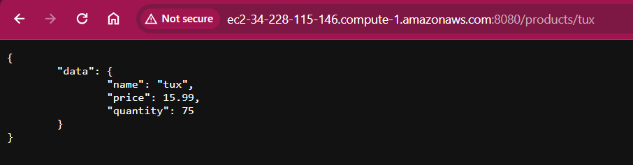
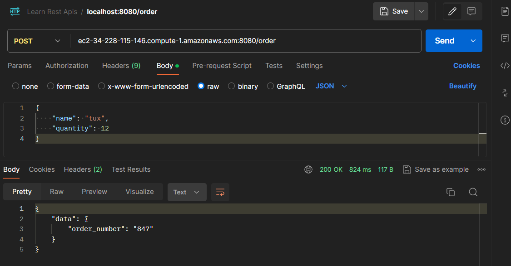
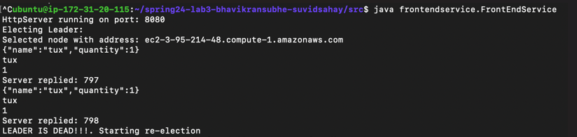
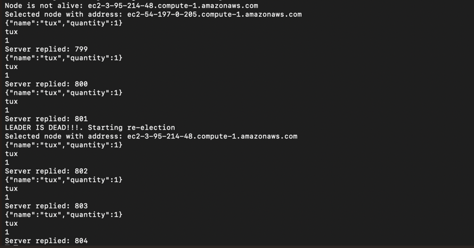
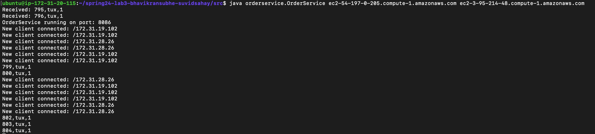
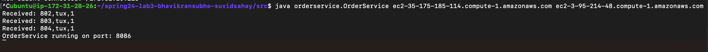
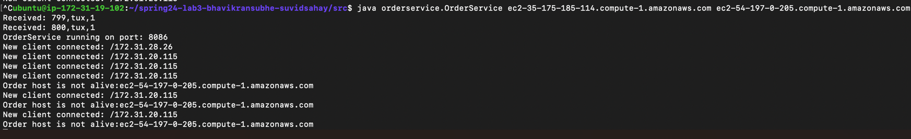
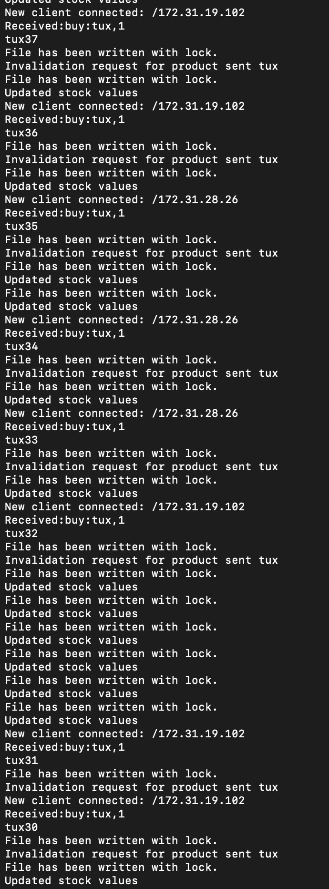

# Testing Procedure:

### 1) Testing basic application functionality on AWS instance

#### a. Query request

#### b. Buy request

### 2) Entire application test
To run tests on the application you can run:

    ubuntu@ip-172-31-26-189:~/677/spring24-lab3-bhavikransubhe-suvidsahay/src/test/client$ javac ClientTest.java
    ubuntu@ip-172-31-26-189:~/677/spring24-lab3-bhavikransubhe-suvidsahay/src/test/client$ java ClientTest.java

Output

    TEST PASSED : Returned order numbers are equal to given order numbers.
    TEST PASSED: Successfully got product not found or out of stock(404 response code)

### 3) Simulating crash failures

1. Frontend service electing leader and re-electing leaders whenever current leader is dead

> Finally, simulate crash failures by killing a random order service replica while the clients is running, and then bring it back online after some time. Repeat this experiment several times and make sure that you test the case when the leader is killed. Can the clients notice the failures (either during order requests or the final order checking phase) or are they transparent to the clients?

No clients don't notice the failure because the system is failure transparent. Whenever the leader node has crashed, the frontend service contests a re-election 
and sends the request to the newly elected leader. 

> Do all the order service replicas end up with the same database file?

Yes as given below, the order service replicas sync when they restart and they end up with the same database file.

2. Order service 3 replicas

    Images showing data consistency across all replicas.

Replica 1

Replica 2

Replica 3

3. Catalog service updates

